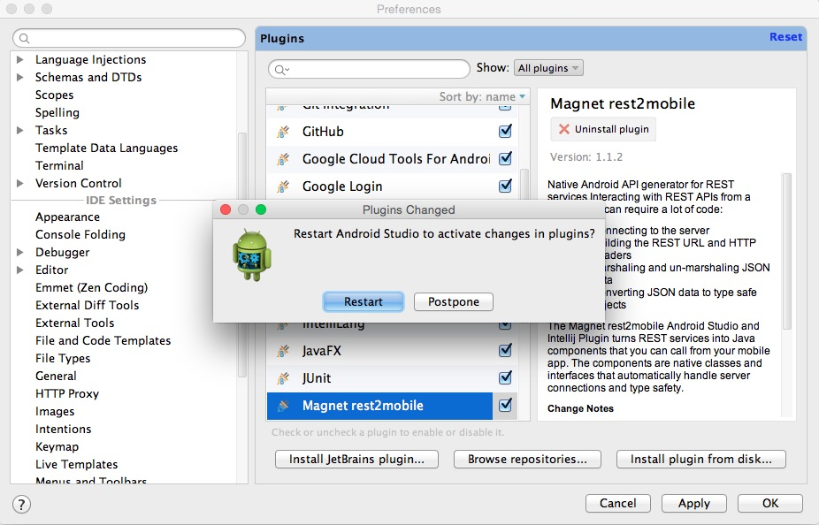
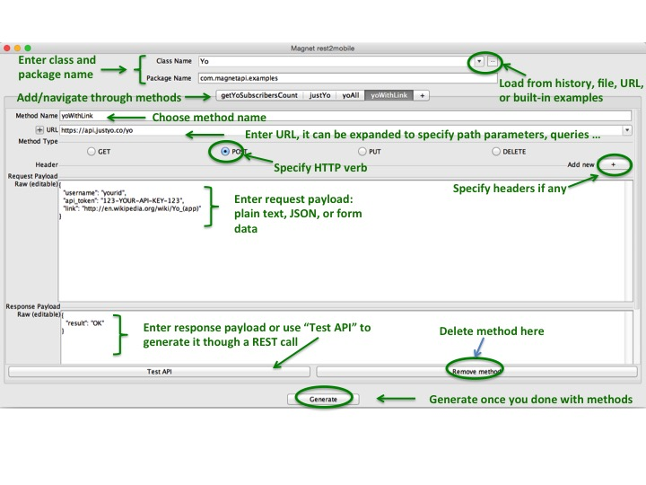
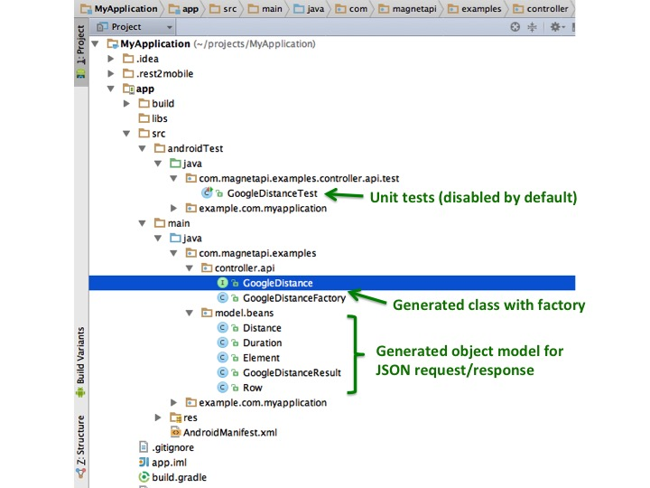

## rest2mobile plugin for Android Studio & IntelliJ IDEA

### Stable releases
* [1.1.0](https://github.com/magnetsystems/r2m-plugin-android/releases/1.1.0)
* [1.0.0](https://github.com/magnetsystems/r2m-plugin-android/releases/v1.0.0)

### Latest drop
* [Check releases](https://github.com/magnetsystems/r2m-plugin-android/releases/)

### Prerequisites
The rest2mobile plugin for Android Studio & IntelliJ IDEA has these prerequisites:

* Java JDK 1.6 or later
* Android Studio or IntelliJ IDEA
* Android 'minSDKVersion' value of 15 or later

### Build

Use Intellij 13 or later to create the plugin project from the source:
* create the project from the source directory <code>src</code>
* register the <code>res</code> and <code>l10n</code> directories as resources
* register the <code>libs</code> directory as a library 

Build the plugin zip using the <code>Build->Prepare Plugin Module ... for deployment</code> option.

### Releases

Download the latest release [here](https://github.com/magnetsystems/r2m-plugin-android/releases).

The following picture is a screenshot of the plugin: 

### Setup

The installation instructions are summarized [here](http://developer.magnet.com/android).

Be sure you include the rest2mobile Android SDK in your app by inserting this in your app's <code>build.gradle</code>.
```groovy
repositories {
    maven {
        url "http://repo.magnet.com:8081/artifactory/public/"
    }
    mavenLocal()
    mavenCentral()
}
dependencies {
    compile("com.magnet:r2m-sdk-android:1.1.0@aar") {
        transitive = true
    }
}
```

__STEP 1: Download__

Go to the [releases](https://github.com/magnetsystems/r2m-plugin-android/releases) and download the latest installer. 

*Note: You can find the latest official release on the [Magnet developer](http://developer.magnet.com/android] site too.*


__STEP 2: Install plugin__

In Android Studio or IntelliJ, go to <code>Preferences -> Plugins</code> and click on <code>Install plugin from disk...</code>


It will ask you to choose the location of the installer zip, point to the package that you've just downloaded.

*Note: the plugin is also distributed on the Jetbrains repository, so instead of clicking on <code>Install plugin from disk...</code>, you can choose <code>Browse repositories...</code> and then look for <code>rest2mobile</code>.*

__STEP 3: Restart your IDE after loading the plugin__



__STEP 4: Load or create an android application__


It is recommended to use a gradle-based application (if you are still using ant, go [here](https://github.com/magnetsystems/rest2mobile/wiki/rest2mobile-setup-ant)). 

Ensure that you use at a __minimum__ the Android API level 15. 

__STEP 5: Add new API__

Once the IDE has restarted, you should see the new R2M menu (or "Magnet" menu in earlier releases):


Choose "Add new API" from the R2M menu ('Magnet' menu for earlier releases). The following describes the wizard options:



Alternatively, instead of crafting your own REST invocations, you can load existing examples from the [r2m-examples github repo](https://github.com/magnetsystems/r2m-examples) by clicking on the browse icon next to the <code>Class Name</code> box:


__STEP 6: Generate code__

Click on "Generate", this generates the code under your <code>src</code> directory. If you have a <code>src/androidTest/java</code> directory, a unit test file is also generated.

Ex: say you selected the <code>GoogleDistance</code> built-in example, you should see the following files in your project pane:



__STEP 7: Test__

Use the generated unit test generated under <code>src/androidtest/java/</code>

Ex: if you generated the <code>GoogleDistance</code> native API, the unit test can be found atr <code>src/androidTest/java/com/magnetapi/examples/controller/api/test/GoogleDistanceTest</code>. Remove the <code>@Supress</code> annotation on <code>testGoogleDistance</code>, and invoke the API with real values:

```java
  /**
    * Generated unit test for {@link GoogleDistance#googleDistance}
    */
  @SmallTest
  public void testGoogleDistance() throws SchemaException, ExecutionException, InterruptedException {
    String origins = "435 Tasso Street, Palo Alto CA";
    String destinations = "1 Embarcadero Street, San Francisco, CA";
    String sensor = "false";
    String mode = "driving";
    String language = "en";
    String units = "imperial";

    Call<GoogleDistanceResult> callObject = googleDistance.googleDistance(
      origins, 
      destinations, 
      sensor, 
      mode, 
      language, 
      units, null); 
    GoogleDistanceResult result = callObject.get(); // Or use a non-null 'StateChangedListener' in 'googleDistance' to be asynchronously called back, once result is avail.
    assertEquals("33.9 mi", result.getRows().get(0).getElements().get(0).getDistance().getText());// actual distance may vary
  }
```

Notice how the rest2mobile's java invocation allows you to safely navigate the JSON payload:

*Strongly-typed in java:*

```java
   String distance = result.getRows().get(0).getElements().get(0).getDistance().getText());
``` 
*Stringly-typed in JSON:*
```json
{
   "destination_addresses" : [ "1 Lombard Street, San Francisco, CA 94111, USA" ],
   "origin_addresses" : [ "435 Tasso Street, Palo Alto, CA 94301, USA" ],
   "rows" : [
      {
         "elements" : [
            {
               "distance" : {
                  "text" : "33.9 mi",
                  "value" : 54605
               },
               "duration" : {
                  "text" : "44 mins",
                  "value" : 2626
               },
               "status" : "OK"
            }
         ]
      }
   ],
   "status" : "OK"
}
```


### Feedback

We are constantly adding features and welcome feedback. 
Please, ask questions or file requests [here](https://github.com/magnetsystems/r2m-plugin-android/issues).

### Blog

Get latest tips, news, and useful information from our [blog](http://www.magnet.com/dev-blog/)

## License

Licensed under the **[Apache License, Version 2.0] [license]** (the "License");
you may not use this software except in compliance with the License.

## Copyright

Copyright © 2014 Magnet Systems, Inc. All rigghts reserved.

[website]: http://developer.magnet.com
[techdoc]: https://github.com/magnetsystems/rest2mobile/wiki
[r2m-plugin-android]:https://github.com/magnetsystems/r2m-plugin-android/
[r2m-plugin-ios]:https://github.com/magnetsystems/r2m-plugin-ios/
[r2m-cli]:https://github.com/magnetsystems/r2m-cli/
[license]: http://www.apache.org/licenses/LICENSE-2.0
[r2m wiki]:https://github.com/magnetsystems/r2m-cli/wiki
